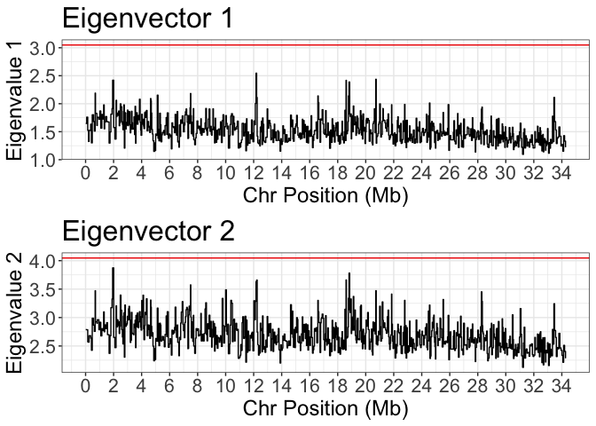
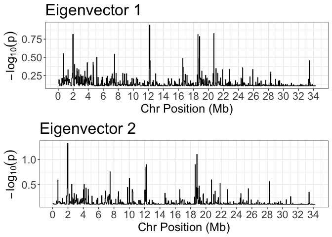
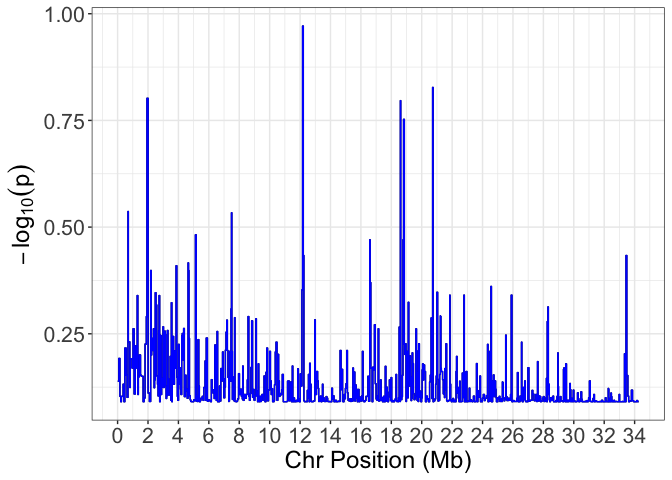

AFvapeR
=======

### Allele Frequency Vector Analysis of Parallel Evolution in R

The aim of this software is to quantify and compare parallel genotype
change based on allele frequency changes between population pairs. The
software produces a series of allele frequency matrices with n (number
of snps per window) columns and m (number of population pairs) rows.
Within each matrix, we perform eigen analysis to quantify skew in the
eigenvalue distribution. An eigenvalue distribution with elevated
eigenvalues on the first eigenvectors is indicative of a common
trajectory through multivariate space for more than one population pair
(ie. parallel or antiparallel genotype change in multiple populations).
Multiple eigenvectors with elevated eigenvalues is indicative of
multiple parallel/antiparallel axes within a genomic region,
highlighting nonparallelism.

### Load from development dir

``` r
devtools::load_all("~/Exeter/afvaper/")
```

    ## ℹ Loading afvaper

### Parallelism Definitions:

Parallel - Change along the same axis in the same direction.
Antiparallel - Change along the same axis in the opposite direction.
Nonparallel - Change along an alternative axis.

Demo
----

### Make the inputs

The software runs in R and requires the following inputs:

-   A vcfR object of a chromosome, eg:

``` r
library(vcfR)
```

    ## 
    ##    *****       ***   vcfR   ***       *****
    ##    This is vcfR 1.12.0 
    ##      browseVignettes('vcfR') # Documentation
    ##      citation('vcfR') # Citation
    ##    *****       *****      *****       *****

``` r
vcf_path <- "~/Exeter/VCFs/five_aside_STAR_3033083_final.vcf.gz"
chr <- "chr1"

# Subset for the chr using bcftools and read the file into R
# We can subset a VCF on the system somewhere using software like BCFtools
vcf_tempfile <- tempfile(pattern = "chr_tmp", fileext = '.vcf')
on.exit({ unlink(vcf_tempfile) })
system(paste0("bcftools view -r ",chr," ",vcf_path," > ",vcf_tempfile), wait=TRUE)

# Read in input       
vcf_input_chr1 <- read.vcfR(vcf_tempfile,verbose = F)
vcf_input_chr1
```

    ## ***** Object of Class vcfR *****
    ## 176 samples
    ## 1 CHROMs
    ## 148,514 variants
    ## Object size: 480.9 Mb
    ## 0 percent missing data
    ## *****        *****         *****

-   A popmap, with individuals in column 1 and populations in column 2,
    eg.

``` r
# We can fetch individuals from the vcfR object
popmap <- data.frame(inds = colnames(vcf_input_chr1@gt)[2:ncol(vcf_input_chr1@gt)])

# Add in population identifiers
popmap$pop <- gsub('[0-9]+', '', popmap$inds)
popmap$pop <- gsub('_F', '', popmap$pop)
popmap$pop <- gsub('_M', '', popmap$pop)

# Show popmap
head(popmap)
```

    ##       inds  pop
    ## 1  APHP_F1 APHP
    ## 2 APHP_F10 APHP
    ## 3  APHP_F2 APHP
    ## 4  APHP_F3 APHP
    ## 5  APHP_F4 APHP
    ## 6  APHP_F5 APHP

-   A list of vectors describing parallel replicates. These are based on
    population identifiers in the popmap, and in all cases the first and
    second population should be in the same direction, i.e. for Ecotype1
    vs Ecotype2, all first populations should be Ecotype1 and all second
    populations should be Ecotype2. Provide names for each replicate for
    downstream summaries. To build the vector list:

``` r
# View populations in the popmap
unique(popmap$pop)
```

    ##  [1] "APHP" "APLP" "GH"   "GL"   "LMD"  "LO"   "LT"   "UMD"  "UQ"   "UT"

``` r
# Build vector list
vector_list <- list(c("LT","UT"),
                    c("GH","GL"),
                    c("APHP","APLP"),
                    c("LO","UQ"),
                    c("LMD","UMD"))

# Name vectors
names(vector_list) <- c("Tacarigua","Guanapo","Aripo","Oropuche","Madamas")

# Show vector list
vector_list
```

    ## $Tacarigua
    ## [1] "LT" "UT"
    ## 
    ## $Guanapo
    ## [1] "GH" "GL"
    ## 
    ## $Aripo
    ## [1] "APHP" "APLP"
    ## 
    ## $Oropuche
    ## [1] "LO" "UQ"
    ## 
    ## $Madamas
    ## [1] "LMD" "UMD"

### Calculate Allele Frequency Change Vectors

In order to analyse our VCF, we need to transform the inputs into a list
allele frequency changes matrices, where each row is the normalised
allele frequency change vector for one of our replicates, for N SNPs
(where N is our window size). This is handled with the
`calc_AF_vectors()` function:

``` r
# Set our window size
window_snps = 200

# Calculate Allele Frequency Change Vector Matrices
AF_input <- calc_AF_vectors(vcf = vcf_input_chr1,
                            window_size = window_snps,
                            popmap = popmap,
                            vectors = vector_list,
                            n_cores = 4)
```

    ## Calculating AF vectors for 742 windows with 200 SNPs each

    ## Popmap check passed, all popmap inds are in VCF

    ## VCF check passed, all VCF inds are in popmap

``` r
# Show features of input...
print(paste0("Number of windows = ",length(AF_input)))
```

    ## [1] "Number of windows = 742"

``` r
print(paste0("Number of SNPs per window = ",ncol(AF_input[[1]])))
```

    ## [1] "Number of SNPs per window = 200"

``` r
print(paste0("Number of vectors per window = ",nrow(AF_input[[1]])))
```

    ## [1] "Number of vectors per window = 5"

We also want to build a set of null vectors, in which the population
assignment is shuffled among individuals and new vectors are calculated
using the same structure as the originals. We do this using the same
function, but pass a `null_perms` value to describe how many random
vectors to calculate:

``` r
# How many permutations to run
null_perm_N = 1000

# Calculate Allele Frequency Change Vector Matrices
null_input <- calc_AF_vectors(vcf = vcf_input_chr1,
                            window_size = window_snps,
                            popmap = popmap,
                            vectors = vector_list,
                            n_cores = 4,
                            null_perms = null_perm_N)
```

    ## Calculating NULL AF vectors for 1000 windows with 200 SNPs each

    ## Popmap check passed, all popmap inds are in VCF

    ## VCF check passed, all VCF inds are in popmap

``` r
# Show features of input...
print(paste0("Number of null windows = ",length(null_input)))
```

    ## [1] "Number of null windows = 1000"

``` r
print(paste0("Number of SNPs per window = ",ncol(null_input[[1]])))
```

    ## [1] "Number of SNPs per window = 200"

``` r
print(paste0("Number of vectors per window = ",nrow(null_input[[1]])))
```

    ## [1] "Number of vectors per window = 5"

Note here that 1000 null permutations is on the low size, and a value
closer to 10,000+ would be better. In practise, given it is easiest to
run these functions over separate chromosomes, we can aim for a total of
10,000 null vectors from across all chromosomes and combine null vectors
calculated on individual chromosomes. The easiest way to do this is to
divide the desired total of 10,000 (or more) up between chromosomes
based on the relative sizes (this info is available in a genome fasta
index for e.g.). If we store each per-chromosome set of `null_input`
vectors to a list, we can easily merge these into a single list with:
`merged_null_input <- unlist(all_chr_null_input_list,recursive=FALSE)`.
This `merged_null_input` can then be used as detailed below.

### Perform Eigen Analysis Over Allele Frequency Matrices

Taking the `AF_input` data, we can perform eigen analyses over all
matrices with a single command:

``` r
# Perform eigen analysis
eigen_res <- lapply(AF_input,eigen_analyse_vectors)
```

The `eigen_res` output is a list containing, for each matrix, the
eigenvalue distribution, the eigenvector loadings, and the projected A
matrix that shows per-SNP scores for each eigenvector. The chromosomal
regions are stored in `names(eigen_res)`:

``` r
# View chromosomal regions:
head(names(eigen_res))
```

    ## [1] "chr1:12058-81543"   "chr1:81669-152842"  "chr1:152857-206794"
    ## [4] "chr1:208427-250790" "chr1:251000-362599" "chr1:362644-417859"

``` r
# View eigenvalue distribution of first matrix
eigen_res[[1]]$eigenvals
```

    ## Eigenvector_1 Eigenvector_2 Eigenvector_3 Eigenvector_4 Eigenvector_5 
    ##     1.6476337     1.1401397     0.9495169     0.8518752     0.4108344

``` r
# View eigenvector loadings of first matrix
eigen_res[[1]]$eigenvecs
```

    ##           Eigenvector_1 Eigenvector_2 Eigenvector_3 Eigenvector_4
    ## Tacarigua    -0.2441412  -0.499960509     0.5434971    0.62815949
    ## Guanapo      -0.6468302  -0.006768749    -0.3633949    0.03474299
    ## Aripo        -0.2751444  -0.550490934     0.2351333   -0.74493053
    ## Oropuche     -0.6489972   0.279993700    -0.1152724    0.09398880
    ## Madamas       0.1584423  -0.607088900    -0.7099152    0.20112980
    ##           Eigenvector_5
    ## Tacarigua    0.02147388
    ## Guanapo      0.66955355
    ## Aripo       -0.10510056
    ## Oropuche    -0.69158118
    ## Madamas     -0.24880969

``` r
# View head of SNP scores
head(eigen_res[[1]]$A_matrix)
```

    ##                    [,1]        [,2]         [,3]          [,4]        [,5]
    ## chr1_12058 -0.022999608 -0.03325563  0.006138938  0.0651235808  0.10162457
    ## chr1_12063  0.054749929  0.02179478  0.015656304  0.0265006064 -0.04156291
    ## chr1_12070 -0.011011967 -0.04616535  0.001752028 -0.0004192674  0.10029189
    ## chr1_12124  0.033998496  0.08431921 -0.083821785 -0.0267704686  0.03343746
    ## chr1_12136  0.002787735 -0.09110843  0.099973278  0.1522867042  0.06193268
    ## chr1_12198  0.055376675  0.16434419 -0.150979943 -0.0307503144  0.04019390

### Merge results from different chromosomes

Having calculated `eigen_res` across different chromosomes, we can then
combine these by listing them out and reducing down the list:

    eigen_res_list <- list(eigen_res_chr1,eigen_res_chr2,eigen_res_chr3)
    allchr_eigen_res <- merge_eigen_res(eigen_res_list)

If running over multiple chromosomes, it is recommended to do merge
results across chromosomes before proceeding onto analysis…

### Find Null Cutoffs

Using our `null_input`, we can output a matrix containing the cutoff
expectations from the null distribution for each eigenvector for various
significance thresholds:

``` r
# Get cutoffs for 95%, 99% and 99.9%
null_cutoffs <- find_null_cutoff(null_input,cutoffs = c(0.95,0.99,0.999))
null_cutoffs
```

    ##                    95%      99%    99.9%
    ## Eigenvector 1 2.763357 3.186046 3.752044
    ## Eigenvector 2 3.853560 4.145955 4.290095
    ## Eigenvector 3 4.451113 4.603374 4.729088
    ## Eigenvector 4 4.818593 4.872730 4.903617
    ## Eigenvector 5 5.000000 5.000000 5.000000

Here, the values are summed through eigenvalues, such that the value for
Eigenvector 2 is the sum of Eigenvalues 1 + 2, and the maximum value is
equivalent to the number of replicates (`length(vector_list)`).

### Calculate p-values

We can also calculate one-tailed p-values by comparing our observed
eigenvalues to the null distribution. These are conceptually similar to
using cutoffs, i.e. anything above the 95% cutoff outlined above will
have a p-value &lt; 0.05, however they can be useful for removing noise
and highlighting peaks. These are calculated using the `eigen_res`
results and the `null_input` vectors, and as output we get p-values for
each eigenvector and window.

``` r
# Calculate p-vals
pvals <- eigen_pvals(eigen_res,null_input)

# Show lowest pvals
head(pvals)
```

    ##                    Eigenvalue_1 Eigenvalue_2 Eigenvalue_3 Eigenvalue_4
    ## chr1:12058-81543      0.7262737    0.5244755   0.18181818  0.007992008
    ## chr1:81669-152842     0.6423576    0.7062937   0.14585415  0.006993007
    ## chr1:152857-206794    0.7882118    0.6753247   0.09490509  0.001998002
    ## chr1:208427-250790    0.8111888    0.3456543   0.12187812  0.001998002
    ## chr1:251000-362599    0.7882118    0.4885115   0.03196803  0.052947053
    ## chr1:362644-417859    0.7382617    0.7292707   0.14985015  0.016983017
    ##                    Eigenvalue_5
    ## chr1:12058-81543    0.211788212
    ## chr1:81669-152842   0.304695305
    ## chr1:152857-206794  0.083916084
    ## chr1:208427-250790  0.039960040
    ## chr1:251000-362599  0.049950050
    ## chr1:362644-417859  0.008991009

Note: Because these p-values are calculated by comparing to the null
distribution, they are bounded by the number of permutations. For
e.g. if you run 1000 permuations, the lowest possible p-value for an
observed value that exceeds all 1000 of the null values is simply
(0+1/1000+1) which is \~ 0.001. If we ran 10,000 permutations and again
had an observed eigenvalue greater than all 10,000 null values, this
would be \~ 0.0001 e.t.c.

Consider this when interpreting p-values.

### Plot Eigenvalues Along Chromosomes

We can plot the eigenvalues for each chromosome, either plotting the raw
eigenvalues or the associated p-values. The output of `eigenval_plot()`
gives a figure for each eigenvector:

``` r
# Plot the raw eigenvalues, and visualise the cutoff of 99%
all_plots <- eigenval_plot(eigen_res,cutoffs = null_cutoffs[,"99%"])

# Show the plots for eigenvalue 1 and 2
cowplot::plot_grid(all_plots[[1]],all_plots[[2]],ncol=1)
```



Alternatively, we can plot the p-values:

``` r
# Plot the raw eigenvalues, and visualise the cutoff of 99%
all_plots_p <- eigenval_plot(eigen_res,null_vectors = null_input,plot.pvalues = T)

# Show the plots for eigenvalue 1 and 2
cowplot::plot_grid(all_plots_p[[1]],all_plots_p[[2]],ncol=1)
```



Note here, each of the plots is a ggplot object that can be extracted
and edited however you like, for e.g. we can remove the title and change
the colour with ease using standard ggplot syntax:

``` r
# Pull the figure 
eig1_pval_fig <- all_plots_p[[1]]

# Edit
eig1_pval_fig + theme(title = element_blank()) + geom_step(colour="blue")
```



### Pull Significant Windows

Using the `eigen_res` results and `null_cutoffs`, we can identify
windows that exceed the null cutoffs and return a list of genome
windows. Here, we will use a made-up set of null cutoffs just to
demonstrate the format of the output here:

``` r
# Make dummy cutoffs
dummy_cutoffs <- c(2.5,3.5,4.8,4.9,5.0)

# Find dummy significant windows
dummy_significant_windows <- signif_eigen_windows(eigen_res,dummy_cutoffs)

# Display 'outliers'
dummy_significant_windows[1:4]
```

    ## $`Eigenvector 1`
    ## [1] "chr1:12164434-12213430"
    ## 
    ## $`Eigenvector 2`
    ## [1] "chr1:1930743-2005421"   "chr1:7488348-7512490"   "chr1:12213437-12250908"
    ## [4] "chr1:18595966-18619460" "chr1:18805775-18857448"
    ## 
    ## $`Eigenvector 3`
    ## [1] NA
    ## 
    ## $`Eigenvector 4`
    ## logical(0)

### Summarise Outliers

To make sense of outliers, we want to summarise various information
within candidate windows. This includes: which of our replicate vectors
are associated with the relevant eigenvector (i.e. which vectors load
above a certain threshold onto eigenvector 1); and whether vectors are
associated in the same (parallel) or different (antiparallel) direction.

We also want to know for genome regions that exhibited elevated
eigenvalues on eigenvectors 2+, what is happening on all preceeding
eigenvectors. This is because we are always summing the eigenvalues, and
as such a large eigenvalue 2 sum reflects that most allele frequency
variance is captured by the first 2 eigenvectors.

The `summarise_window_parallelism()` function takes this into account,
and returns all of this information into an output table for
interpretation. The user defines the loading cutoff (which is an
absolute value):

``` r
# Summarise parallel evolution in windows that are significant on eigenvector 1
eig1_parallel <- summarise_window_parallelism(window_id = "chr1:12164434-12213430",
                                              eigen_res = eigen_res,
                                              loading_cutoff = 0.3,
                                              eigenvector = 1)
# Show results
eig1_parallel
```

    ##                window_id eigenvector parallel_lineages
    ## 1 chr1:12164434-12213430        Eig1                 4
    ##                      parallel_pops antiparallel_pops
    ## 1 Tacarigua,Guanapo,Aripo,Oropuche

This output therefore tells us how many replicates are associated with
the first eigenvector at this genomic region (using the
`names(vector_list)` provided earlier), and lists which of these are
parallel or anti-parallel.

If we want to look at multiple windows, we can simply loop over them,
for e.g. here for eigenvector 2 outliers:

``` r
eig2_parallel=NULL
for(window in dummy_significant_windows[[2]]){
  
  # Summarise
  window_tmp <- summarise_window_parallelism(window_id = window,
                                              eigen_res = eigen_res,
                                              loading_cutoff = 0.3,
                                              eigenvector = 2)
  
  # Bind
  eig2_parallel <- rbind(eig2_parallel,window_tmp)
}

# Show results
eig2_parallel
```

    ##                 window_id eigenvector parallel_lineages
    ## 1    chr1:1930743-2005421        Eig1                 3
    ## 2    chr1:1930743-2005421        Eig2                 2
    ## 3    chr1:7488348-7512490        Eig1                 4
    ## 4    chr1:7488348-7512490        Eig2                 3
    ## 5  chr1:12213437-12250908        Eig1                 4
    ## 6  chr1:12213437-12250908        Eig2                 4
    ## 7  chr1:18595966-18619460        Eig1                 4
    ## 8  chr1:18595966-18619460        Eig2                 4
    ## 9  chr1:18805775-18857448        Eig1                 3
    ## 10 chr1:18805775-18857448        Eig2                 3
    ##                     parallel_pops          antiparallel_pops
    ## 1                           Aripo          Tacarigua,Guanapo
    ## 2                Oropuche,Madamas                           
    ## 3  Guanapo,Aripo,Oropuche,Madamas                           
    ## 4               Tacarigua,Madamas                    Guanapo
    ## 5                         Madamas Tacarigua,Guanapo,Oropuche
    ## 6                 Guanapo,Madamas             Aripo,Oropuche
    ## 7          Guanapo,Aripo,Oropuche                    Madamas
    ## 8                        Oropuche    Tacarigua,Aripo,Madamas
    ## 9                 Tacarigua,Aripo                    Guanapo
    ## 10                Guanapo,Madamas                   Oropuche

Here we have the same information, but with 2 rows per window for each
eigenvector up to the focal eigenvector (in this case set as
`eigenvector = 2`).

Workflow Summary
----------------


