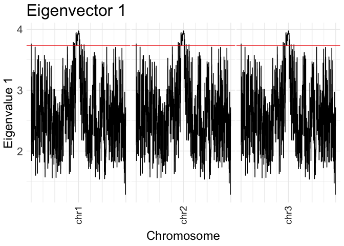

AF-vapeR Manual v0.2.1
================
James R Whiting
2022-08-12

# Allele Frequency Vector Analysis of Parallel Evolutionary Responses

The aim of this software is to quantify and compare parallel genotype
change based on allele frequency changes between population pairs. The
software produces a series of allele frequency matrices with n (number
of snps per window) columns and m (number of population pairs) rows.
Within each matrix, we perform eigen analysis to quantify skew in the
underlying eigenvalue distributions across the genome. An eigenvalue
distribution with elevated eigenvalues on the first eigenvector is
indicative of a common trajectory through multivariate space for more
than one population pair (ie. parallel or antiparallel genotype change
in multiple populations). Multiple eigenvectors with elevated
eigenvalues is indicative of multiple parallel/antiparallel axes within
a genomic region, highlighting nonparallelism.

For more information on the software, please see the accompanying
preprint: <https://www.biorxiv.org/content/10.1101/2021.09.17.460770v1>

<!-- ### Load from development dir -->
<!-- ```{r} -->
<!-- devtools::load_all("~/Exeter/afvaper/") -->
<!-- ``` -->

### Installation

``` r
# install.packages("remotes",repos = "http://cran.us.r-project.org")
# remotes::install_github("JimWhiting91/afvaper")
library(afvaper,verbose = F)
```

### Parallelism Definitions:

-   Parallel - Change along the same axis in the same direction.
-   Antiparallel - Change along the same axis in the opposite direction.
-   Nonparallel - Change along an alternative axis.
-   Multi-parallel - Parallelism along multiple non-parallel axes, for
    e.g. 2 of 4 pops are parallel on eigenvector 1, and the other 2 pops
    are parallel on eigenvector 2.

## Workflow Summary


# Demo

### Make the inputs

The software runs in R and requires the following inputs:

-   A vcfR object of a chromosome (here we are using simulated data),
    eg:

``` r
library(vcfR,verbose = F)
```

    ## 
    ##    *****       ***   vcfR   ***       *****
    ##    This is vcfR 1.13.0 
    ##      browseVignettes('vcfR') # Documentation
    ##      citation('vcfR') # Citation
    ##    *****       *****      *****       *****

``` r
vcf_in <- read.vcfR(system.file("full_parallel.vcf.gz",package="afvaper"),verbose = F)
vcf_in
```

    ## ***** Object of Class vcfR *****
    ## 100 samples
    ## 1 CHROMs
    ## 169,184 variants
    ## Object size: 150.4 Mb
    ## 0 percent missing data
    ## *****        *****         *****

``` r
# For your own data:
# vcf_in <- read.vcfR("/path/to/chromosome-vcf/")
```

-   As of v0.2 we can alternatively provide as input a matrix of
    population-level allele frequencies. This matrix should be in the
    form of a row for each SNP, where columns 1 and 2 have the
    chromosome and bp position of each SNP. Each column from 3 onwards
    should include the population allele frequency for a population
    included in the vectors. The pop names used in column headers must
    match the pop IDs in the vectors, e.g.

``` r
# An example matrix with the necessary formatting
example_freq_matrix <- data.frame(chr = c("chr1","chr1","chr1"),
                                         pos = c(1,10,50),
                                         pop1 = c(0.2,0.5,0.7),
                                         pop2 = c(0.1,0.1,0.3),
                                         pop3 = c(0.6,0.1,0.2),
                                         pop4 = c(0.2,0.4,0),
                                         pop5 = c(0.4,0.8,1.0))
example_freq_matrix
```

    ##    chr pos pop1 pop2 pop3 pop4 pop5
    ## 1 chr1   1  0.2  0.1  0.6  0.2  0.4
    ## 2 chr1  10  0.5  0.1  0.1  0.4  0.8
    ## 3 chr1  50  0.7  0.3  0.2  0.0  1.0

-   A popmap, with individuals in column 1 and
    population/habitat/ecotype in column 2, eg. (Note, if using an AF
    frequency table, a popmap is not required)

``` r
popmap <- read.table(system.file("full_parallel.popmap",package="afvaper"))

# Show popmap
head(popmap)
```

    ##         V1   V2
    ## 1  msp_207 pop1
    ## 2  msp_223 pop1
    ## 3 msp_1390 pop1
    ## 4 msp_1426 pop1
    ## 5 msp_2045 pop1
    ## 6 msp_2268 pop1

-   A list of vectors describing parallel replicates. These are based on
    population identifiers in the popmap, and in all cases the first and
    second population should be in the same direction, i.e. for Ecotype1
    vs Ecotype2, all first populations should be Ecotype1 and all second
    populations should be Ecotype2. Here for example, pop1 represents
    Ecotype 1, and pop2-5 represent Ecotype 2. In this data, we are
    interested in the change in allele frequencies from pop1 to each of
    pops 2-5, as in these simulations pop1 is the founding/ancestral
    population from which pops 2-5 have diverged from. To build the
    vector list:

``` r
# View populations in the popmap
unique(popmap[,2])
```

    ## [1] "pop1" "pop2" "pop3" "pop4" "pop5"

``` r
# Build vector list
vector_list <- list(c("pop1","pop2"),
                    c("pop1","pop3"),
                    c("pop1","pop4"),
                    c("pop1","pop5"))

# Name vectors
names(vector_list) <- c("pop2","pop3","pop4","pop5")

# Show vector list
vector_list
```

    ## $pop2
    ## [1] "pop1" "pop2"
    ## 
    ## $pop3
    ## [1] "pop1" "pop3"
    ## 
    ## $pop4
    ## [1] "pop1" "pop4"
    ## 
    ## $pop5
    ## [1] "pop1" "pop5"

### Calculate Allele Frequency Change Vectors

In order to analyse our VCF, we need to transform the inputs into a list
of allele frequency change matrices, where each row is the normalised
allele frequency change vector (AFV) for one of our replicates, for N
SNPs (where N is our window size). This is handled with the
`calc_AF_vectors()` function:

``` r
# Set our window size
window_snps = 200

# Calculate Allele Frequency Change Vector Matrices
AF_input <- calc_AF_vectors(vcf = vcf_in,
                            window_size = window_snps,
                            popmap = popmap,
                            vectors = vector_list,
                            n_cores = 4,
                            data_type = "vcf")
```

    ## Calculating AF vectors for 845 windows with 200 SNPs each

    ## Popmap check passed, all popmap inds are in VCF

    ## VCF check passed, all VCF inds are in popmap

``` r
# Show features of input...
print(paste0("Number of windows = ",length(AF_input)))
```

    ## [1] "Number of windows = 845"

``` r
print(paste0("Number of SNPs per window = ",ncol(AF_input[[1]])))
```

    ## [1] "Number of SNPs per window = 200"

``` r
print(paste0("Number of vectors per window = ",nrow(AF_input[[1]])))
```

    ## [1] "Number of vectors per window = 4"

Note, if we are using a matrix of allele frequencies, we set
`data_type="freq"`

We also want to build a set of null vectors, in which the observed
allele frequencies are shuffled among populations and new vectors are
calculated using the same vector structure as the originals. We do this
using the same function, but pass a `null_perms` value to describe how
many random vectors to calculate:

``` r
# How many permutations to run
null_perm_N = 1000

# Calculate Allele Frequency Change Vector Matrices
null_input <- calc_AF_vectors(vcf = vcf_in,
                              window_size = window_snps,
                              popmap = popmap,
                              vectors = vector_list,
                              n_cores = 4,
                              null_perms = null_perm_N,
                              data_type = "vcf")
```

    ## Calculating NULL AF vectors for 1000 windows with 200 SNPs each

    ## Popmap check passed, all popmap inds are in VCF

    ## VCF check passed, all VCF inds are in popmap

``` r
# Show features of input...
print(paste0("Number of null windows = ",length(null_input)))
```

    ## [1] "Number of null windows = 1000"

``` r
print(paste0("Number of SNPs per window = ",ncol(null_input[[1]])))
```

    ## [1] "Number of SNPs per window = 200"

``` r
print(paste0("Number of vectors per window = ",nrow(null_input[[1]])))
```

    ## [1] "Number of vectors per window = 4"

Note here that 1000 null permutations is on the low side, and a value
closer to 10,000+ would be better. In practice, given it is easiest to
run these functions over separate chromosomes, we can aim for a total of
10,000 null vectors from across all chromosomes and combine null vectors
calculated on individual chromosomes. The easiest way to do this is to
divide the desired total of 10,000 (or more) up between chromosomes
based on the relative sizes (this info is available in a genome fasta
index for e.g.).

``` r
# How many permutations do we want in total?
total_perms <- 10000

# Imagine a hypothetical fasta index with three chromosomes
genome_fai <- data.frame(chr=c("chr1","chr2","chr3"),
                         size=c(2e7,4e7,3e7))

# Fetch proportional size of all chromosomes
chr_props <- genome_fai$size/sum(genome_fai$size)
chr_perms <- data.frame(chr=genome_fai$chr,
                        perms=round(chr_props * total_perms))

# This gives us approximately 10000 null perms in total, distributed across the genome according to relative size of chromosomes...
chr_perms
```

    ##    chr perms
    ## 1 chr1  2222
    ## 2 chr2  4444
    ## 3 chr3  3333

If we store each per-chromosome set of `null_input` vectors to a list,
we can easily merge these into a single list with:
`merged_null_input <- unlist(all_chr_null_input_list,recursive=FALSE)`.
This `merged_null_input` can then be used as detailed below.

## Example of splitting analysis over chromosomes

Let’s say we have three chromosomes, and each chromosome is currently
stored as a VCF. We can loop over each VCF and perform the analysis,
saving results as we go. Here I’ll make two identical copies of the
simulated chromosome VCF for demonstration purposes:

``` r
# Make our VCF copies, give them new chromosome identifiers, and save as a list to loop over.
# Note: In practice, if VCFs are stored somewhere on the system, we can just read them in within the loop rather that read them all in beforehand.
vcf_in3 <- vcf_in2 <- vcf_in
vcf_in2@fix[,1] <- "chr2"
vcf_in3@fix[,1] <- "chr3"
vcf_list <- list(vcf_in,vcf_in2,vcf_in3)

# Assume we have already calculated our per-chrom permutation count as chr_perms (see above)
chr_perms
```

    ##    chr perms
    ## 1 chr1  2222
    ## 2 chr2  4444
    ## 3 chr3  3333

``` r
# We can now loop over our chromosome VCFs.
# Here I will just output each per-chrom results to a full list, but we could save the results to .rds files and import back in later...
all_chr_res <- lapply(1:3,function(i){
  
  # First read in the VCF
  #chr_vcf <- read.vcfR(/path/to/vcf)
  chr_vcf <- vcf_list[[i]]
  
  # Calculate AFV
  chr_AF_input <- calc_AF_vectors(vcf = chr_vcf,
                                  window_size = window_snps,
                                  popmap = popmap,
                                  vectors = vector_list,
                                  n_cores = 4)
  
  # Calculate null AFV
  chr_null_input <- calc_AF_vectors(vcf = chr_vcf,
                                    window_size = window_snps,
                                    popmap = popmap,
                                    vectors = vector_list,
                                    n_cores = 4,
                                    null_perms = chr_perms$perms[i])
  
  ## We could save these to some temporary file, e.g.
  # saveRDS(list(chr_AF_input,chr_null_input),paste0("chr",i,"_AFV.rds"))

  # Return our results
  return(list(chr_AF_input,chr_null_input))
})
```

    ## Calculating AF vectors for 845 windows with 200 SNPs each

    ## Popmap check passed, all popmap inds are in VCF

    ## VCF check passed, all VCF inds are in popmap

    ## Calculating NULL AF vectors for 2222 windows with 200 SNPs each

    ## Popmap check passed, all popmap inds are in VCF

    ## VCF check passed, all VCF inds are in popmap

    ## Calculating AF vectors for 845 windows with 200 SNPs each

    ## Popmap check passed, all popmap inds are in VCF

    ## VCF check passed, all VCF inds are in popmap

    ## Calculating NULL AF vectors for 4444 windows with 200 SNPs each

    ## Popmap check passed, all popmap inds are in VCF

    ## VCF check passed, all VCF inds are in popmap

    ## Calculating AF vectors for 845 windows with 200 SNPs each

    ## Popmap check passed, all popmap inds are in VCF

    ## VCF check passed, all VCF inds are in popmap

    ## Calculating NULL AF vectors for 3333 windows with 200 SNPs each

    ## Popmap check passed, all popmap inds are in VCF

    ## VCF check passed, all VCF inds are in popmap

``` r
## If saved as .rds, we can read these back in and merge to single lists
#all_chr_res <- lapply(1:3,function(i) readRDS(paste0("chr",i,"_AFV.rds")))

# To fetch all of  chr AFV, we take the first element of each list element
# Note: the merge_eigen_res() func is the same as unlist(,recursive=F)
AF_input <- merge_eigen_res(lapply(all_chr_res,'[[',1))

# All null, we take the second element of each list element
null_input <- merge_eigen_res(lapply(all_chr_res,'[[',2))

# We now have our whole (3 chr) genome's worth of AFV matrices and null matrices in a single input
c(head(names(AF_input)),tail(names(AF_input)))
```

    ##  [1] "chr1:15-18166"          "chr1:18718-48277"       "chr1:48287-74923"      
    ##  [4] "chr1:75219-95836"       "chr1:96020-119073"      "chr1:119085-144327"    
    ##  [7] "chr3:19808619-19838830" "chr3:19838918-19877336" "chr3:19877527-19907262"
    ## [10] "chr3:19907433-19932368" "chr3:19932509-19954790" "chr3:19954865-19983084"

## Perform Eigen Analysis Over Allele Frequency Matrices

Taking the `AF_input` data, we can perform eigen analyses over all
matrices with a single command. This can be run over the AFV from all
chromosomes as it is not computationally expensive:

``` r
# Perform eigen analysis
eigen_res <- lapply(AF_input,eigen_analyse_vectors)
```

The `eigen_res` output is a list containing, for each matrix, the
eigenvalue distribution, the eigenvector loadings, and the projected A
matrix that shows per-SNP scores for each eigenvector. The chromosomal
regions are stored in `names(eigen_res)`:

``` r
# View chromosomal regions:
head(names(eigen_res))
```

    ## [1] "chr1:15-18166"      "chr1:18718-48277"   "chr1:48287-74923"  
    ## [4] "chr1:75219-95836"   "chr1:96020-119073"  "chr1:119085-144327"

``` r
# View eigenvalue distribution of first matrix
eigen_res[[1]]$eigenvals
```

    ## Eigenvector_1 Eigenvector_2 Eigenvector_3 Eigenvector_4 
    ##    3.76064811    0.16154864    0.04904462    0.02875863

``` r
# View eigenvector loadings of first matrix
eigen_res[[1]]$eigenvecs
```

    ##      Eigenvector_1 Eigenvector_2 Eigenvector_3 Eigenvector_4
    ## pop2    -0.4972237     0.5445576     0.6742875   -0.03952282
    ## pop3    -0.5046727     0.3187280    -0.5982165    0.53465398
    ## pop4    -0.5091357    -0.1106599    -0.3321564   -0.78626165
    ## pop5    -0.4887279    -0.7678697     0.2777508    0.30720625

``` r
# View head of SNP scores
head(eigen_res[[1]]$A_matrix)
```

    ##                  [,1]         [,2]         [,3]          [,4]
    ## chr1_15  -0.197435711  0.054555143  0.001770946 -0.0170353014
    ## chr1_80   0.341119898 -0.026457289  0.002974073 -0.0008671637
    ## chr1_107 -0.011239763  0.002972492 -0.010839676 -0.0025729082
    ## chr1_322  0.001736176 -0.001886557  0.002791756 -0.0002064731
    ## chr1_327  0.106906374 -0.058810758 -0.015690851  0.0035067891
    ## chr1_340  0.053514080 -0.008138263  0.027978499 -0.0010782938

### Find Null Cutoffs

Using our `null_input`, we can output a matrix containing the cutoff
expectations from the null distribution for each eigenvector for various
significance thresholds:

``` r
# Get cutoffs for 95%, 99% and 99.9%
null_cutoffs <- find_null_cutoff(null_input,cutoffs = c(0.95,0.99,0.999))
null_cutoffs
```

    ##                    95%      99%    99.9%
    ## Eigenvector 1 3.473013 3.758088 3.943806
    ## Eigenvector 2 3.837055 3.919276 3.984477
    ## Eigenvector 3 3.958171 3.981431 3.995346
    ## Eigenvector 4 4.000000 4.000000 4.000000

Here, the values are summed through eigenvalues, such that the value for
Eigenvector 2 is the sum of Eigenvalues 1 + 2, and the maximum value is
equivalent to the number of replicates (`length(vector_list)`).

### Calculate empirical p-values

We can also calculate one-tailed empirical p-values (empPvalues) by
comparing our observed eigenvalues to the null distribution. These are
conceptually similar to using cutoffs, i.e. anything above the 95%
cutoff outlined above will have an empPvalue \< 0.05, however they can
be useful for removing noise and highlighting peaks for visualisation.
These are calculated using the `eigen_res` results and the `null_input`
vectors, and as output we get p-values for each eigenvector and window.

``` r
# Calculate p-vals
pvals <- eigen_pvals(eigen_res,null_input)

# Showpvals
head(pvals)
```

    ##                    Eigenvalue_1 Eigenvalue_2 Eigenvalue_3 Eigenvalue_4
    ## chr1:15-18166        0.00990099   0.00950095   0.02210221    0.5536554
    ## chr1:18718-48277     0.80798080   0.57355736   0.71837184    0.8693869
    ## chr1:48287-74923     0.24922492   0.47044704   0.45014501    0.6151615
    ## chr1:75219-95836     0.93439344   0.97509751   0.94629463    0.1340134
    ## chr1:96020-119073    0.27062706   0.30713071   0.25892589    0.6771677
    ## chr1:119085-144327   0.12431243   0.08420842   0.10801080    0.2129213

Note: Because these empPvalues are calculated by comparing to the null
distribution, they are bounded by the number of permutations. For
e.g. if you run 1000 permutations, the lowest possible p-value for an
observed value that exceeds all 1000 of the null values is simply
(0+1/1000+1) which is \~ 0.001. If we ran 10,000 permutations and again
had an observed eigenvalue greater than all 10,000 null values, this
would be \~ 0.0001 e.t.c.

Consider this when interpreting empPvalues, as they are not a true
statistic test!

### Plot Eigenvalues Along Chromosomes

We can plot the eigenvalues for each chromosome, either plotting the raw
eigenvalues or the associated p-values. The output of `eigenval_plot()`
gives a figure for each eigenvector. Each facet panel on the horizontal
gives the results for a separate chromosome (recall here that chr2+3 are
copies of chr1 as above):

``` r
# Plot the raw eigenvalues, and visualise the cutoff of 99%
all_plots <- eigenval_plot(eigen_res,cutoffs = null_cutoffs[,"99%"])

# Show the plots for eigenvalue 1
all_plots[[1]]
```

<!-- -->

Alternatively, we can plot the empPvalues:

``` r
# Plot empirical p-values, -log10(p) of 2 ~ p=0.01, 3 ~ p=0.001 etc.
all_plots_p <- eigenval_plot(eigen_res,null_vectors = null_input,plot.pvalues = T)
```

    ## Calculating empirical p-values for plotting...

``` r
# Show the plots for eigenvalue 1
all_plots_p[[1]]
```

<!-- -->

We can also exploit that all windows are named in the format
`chr:start-end` to plot specific chromosomes using `grep()`:

``` r
# Plot empirical p-values, -log10(p) of 2 ~ p=0.01, 3 ~ p=0.001 etc.
chr1_windows <- grep("chr1",names(eigen_res))
all_plots_p_chr1 <- eigenval_plot(eigen_res[chr1_windows],null_vectors = null_input,plot.pvalues = T)
```

    ## Calculating empirical p-values for plotting...

``` r
# Show the plots for eigenvalue 1
all_plots_p_chr1[[1]]
```

<!-- -->

Note here, each of the plots is a ggplot object that can be extracted
and edited however you like, for e.g. we can remove the title and change
the colour using standard ggplot syntax:

``` r
library(ggplot2,verbose = F)

# Pull the figure 
eig1_pval_fig <- all_plots_p[[1]]

# Edit
eig1_pval_fig + theme(title = element_blank()) + geom_step(colour="red2")
```

<!-- -->

### Pull Significant Windows

Using the `eigen_res()` results and `null_cutoffs()`, we can identify
windows that exceed the null cutoffs and return a list of genome
windows.

IMPORTANT: Because we summing eigenvalues, regions with a very large
eigenvalue 1 may exceed the null cutoffs for several of our eigenvectors
(e.g eigenvector 1, 2 and 3). The function `signif_eigen_windows()` is
aware of this, and only returns windows on the first eigenvector for
which they exceed a cutoff. This prevents windows being marked as
significant on multiple eigenvectors. These window however may still
appear as peaks when plotting, so bear this in mind.

``` r
# Recall the use of find_null_cutoffs() to fetch a matrix of cutoffs...
# null_cutoffs

# Find significant windows above 99.9% null permutation
significant_windows <- signif_eigen_windows(eigen_res,null_cutoffs[,"99.9%"])

# Display 'outliers'
significant_windows
```

    ## $`Eigenvector 1`
    ##  [1] "chr1:9483266-9511933"   "chr1:9973948-10015463"  "chr1:10015604-10045407"
    ##  [4] "chr1:10045553-10083818" "chr2:9483266-9511933"   "chr2:9973948-10015463" 
    ##  [7] "chr2:10015604-10045407" "chr2:10045553-10083818" "chr3:9483266-9511933"  
    ## [10] "chr3:9973948-10015463"  "chr3:10015604-10045407" "chr3:10045553-10083818"
    ## 
    ## $`Eigenvector 2`
    ## [1] "chr1:9883146-9904934" "chr2:9883146-9904934" "chr3:9883146-9904934"
    ## 
    ## $`Eigenvector 3`
    ## [1] "chr1:9904984-9925507" "chr2:9904984-9925507" "chr3:9904984-9925507"
    ## 
    ## $`Eigenvector 4`
    ## [1] "chr1:2174583-2191154" "chr2:2174583-2191154" "chr3:2174583-2191154"

### Summarise Outliers

To make sense of outliers, we want to summarise various information
within candidate windows. This includes: which of our replicate vectors
are associated with the relevant eigenvector (i.e. which vectors load
above a certain threshold onto the focal eigenvector); and whether
vectors are associated in the same (parallel) or different
(antiparallel) direction.

We also want to know for genome regions that exhibited elevated
eigenvalues on eigenvectors 2+, what is happening on all preceeding
eigenvectors. This is because we are always summing the eigenvalues, and
as such a large eigenvalue 2 sum reflects that most allele frequency
variance is captured by the first 2 eigenvectors. This could mean a
large eigenvalue 1 and small eigenvalue 2, or a more balanced eigenvalue
1 + 2. Interpreting this is important for classifying multi-parallelism.

The `summarise_window_parallelism()` function takes this into account,
and returns all of this information into an output table for
interpretation. The user defines the loading cutoff (which is an
absolute value):

``` r
# Summarise parallel evolution in windows that are significant on eigenvector 1
eig1_parallel <- summarise_window_parallelism(window_id = significant_windows[[1]],
                                              eigen_res = eigen_res,
                                              loading_cutoff = 0.3,
                                              eigenvector = 1)
# Show results
head(eig1_parallel)
```

    ##                window_id eigenvector eigenvalue parallel_lineages
    ## 1   chr1:9483266-9511933        Eig1   3.945282                 4
    ## 2  chr1:9973948-10015463        Eig1   3.974657                 4
    ## 3 chr1:10015604-10045407        Eig1   3.972499                 4
    ## 4 chr1:10045553-10083818        Eig1   3.968457                 4
    ## 5   chr2:9483266-9511933        Eig1   3.945282                 4
    ## 6  chr2:9973948-10015463        Eig1   3.974657                 4
    ##         parallel_pops antiparallel_pops
    ## 1 pop2,pop3,pop4,pop5                  
    ## 2 pop2,pop3,pop4,pop5                  
    ## 3 pop2,pop3,pop4,pop5                  
    ## 4 pop2,pop3,pop4,pop5                  
    ## 5 pop2,pop3,pop4,pop5                  
    ## 6 pop2,pop3,pop4,pop5

This output therefore tells us how many replicates are associated with
the first eigenvector at this genomic region (using the
`names(vector_list)` provided earlier), and lists which of these are
parallel or anti-parallel.

For outliers on eigenvectors 2+ we have an additional `eigenvalue_sum`
column that describes the sum of eigenvalues 1 + 2, as well as the
individual eigenvalue 1 and eigenvalue 2 scores for every window. These
tell us that most of these windows are exhibiting a signature closer to
full-parallelism (large eigenvalue 1) rather than multi-parallelism
(more balanced eigenvalue 1 + 2), which is expected for this simulation
(these regions are around the focal 10 Mb fully parallel sweep).

``` r
# Summarise
eig2_parallel <- summarise_window_parallelism(window_id = significant_windows[[2]],
                                              eigen_res = eigen_res,
                                              loading_cutoff = 0.3,
                                              eigenvector = 2)

# Show results
head(eig2_parallel)
```

    ##              window_id eigenvector eigenvalue eigenvalue_sum parallel_lineages
    ## 1 chr1:9883146-9904934        Eig1  3.9412997       3.985715                 4
    ## 2 chr1:9883146-9904934        Eig2  0.0444148       3.985715                 2
    ## 3 chr2:9883146-9904934        Eig1  3.9412997       3.985715                 4
    ## 4 chr2:9883146-9904934        Eig2  0.0444148       3.985715                 2
    ## 5 chr3:9883146-9904934        Eig1  3.9412997       3.985715                 4
    ## 6 chr3:9883146-9904934        Eig2  0.0444148       3.985715                 2
    ##         parallel_pops antiparallel_pops
    ## 1 pop2,pop3,pop4,pop5                  
    ## 2                pop5              pop2
    ## 3 pop2,pop3,pop4,pop5                  
    ## 4                pop5              pop2
    ## 5 pop2,pop3,pop4,pop5                  
    ## 6                pop5              pop2

Interpreting these tables, the eigenvalues, and the distribution of
parallel/antiparallel lineages, is key to filtering out regions that may
be of most interest to particular study questions. For instance, windows
with very large eigenvalues but a mix of parallel and antiparallel
lineages may not be good candidates if the hypothesis is that all
replicate lineages should be evolving using the same alleles…

For more information on interpreting eigenvalue tables, see the
preprint.

### Explore candidate regions

Given a focal candidate region, we may be interested in the genes within
that region, and whether our signal is localised around these genes. To
do this, we can use the per-SNP scores stored within the `A_matrix` slot
of each window’s entry in `eigen_res`. This a matrix with a row per SNP
and a column per eigenvector, given the per-SNP per-eigenvector score of
association:

``` r
# Fetch an A matrix
A_mat <- eigen_res[[1]]$A_matrix
head(A_mat)
```

    ##                  [,1]         [,2]         [,3]          [,4]
    ## chr1_15  -0.197435711  0.054555143  0.001770946 -0.0170353014
    ## chr1_80   0.341119898 -0.026457289  0.002974073 -0.0008671637
    ## chr1_107 -0.011239763  0.002972492 -0.010839676 -0.0025729082
    ## chr1_322  0.001736176 -0.001886557  0.002791756 -0.0002064731
    ## chr1_327  0.106906374 -0.058810758 -0.015690851  0.0035067891
    ## chr1_340  0.053514080 -0.008138263  0.027978499 -0.0010782938

These can be plotted by separating out the `chr` and `pos` values stored
in `rownames(A_mat)`. Note that here we have not polarised the allele
frequencies in any way, by default the analysis just tracks the REF
allele as labelled in the VCF, so both positive and negative scores of
association are of interest. Here then we can just plot the absolute
score:

``` r
to_plot <- data.frame(snp=rownames(A_mat),
                      eig1_score=A_mat[,1])

to_plot <- to_plot %>% tidyr::separate("snp",into=c("chr","pos"),sep="_")
to_plot$pos <- as.integer(to_plot$pos)

ggplot(to_plot,aes(x=pos,y=abs(eig1_score)))+
  geom_point()+
  labs(y="Eig1 Score",x="Pos (bp)")
```

<!-- -->

## Version History

-   v0.2.1 - Minor bug fixes and documentation fixes.

-   v0.2 - Major update, includes the addition of the data_type
    parameter for calc_AF_vectors(), and modification of permutation
    process to shuffle observed frequencies rather than shuffle
    population IDs for individual and recalculate new allele
    frequencies. As such, results based on this permutation approach
    will differ from those of v0.1! Generally this updated permutation
    approach is more conservative than the previous approach.

-   v0.1 - Initial release alongside preprint.
